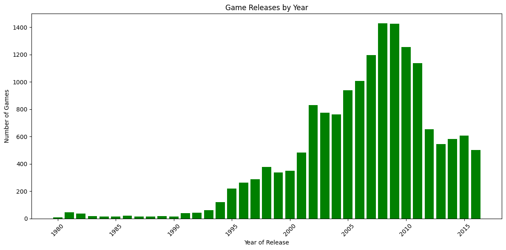
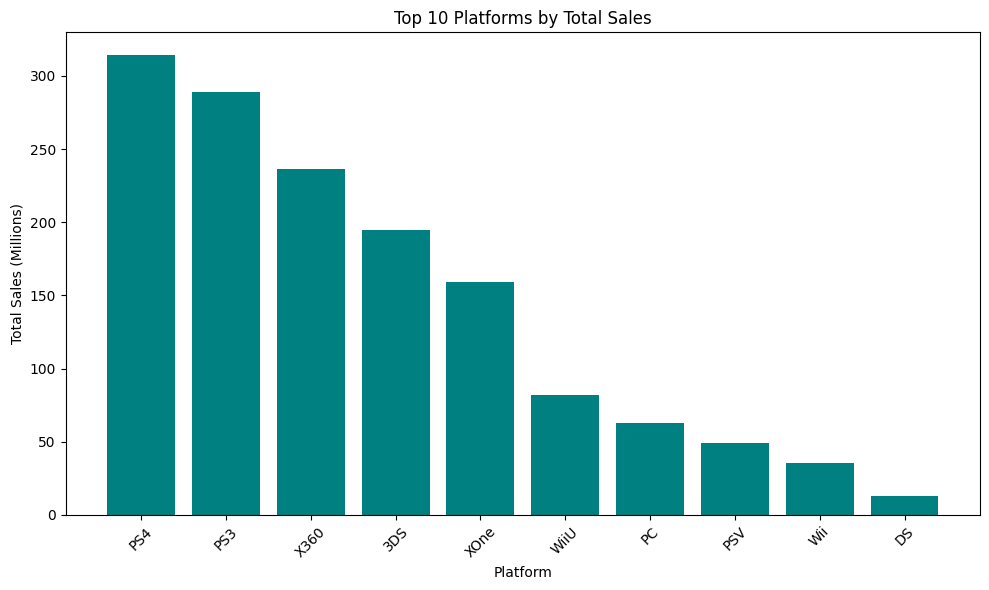
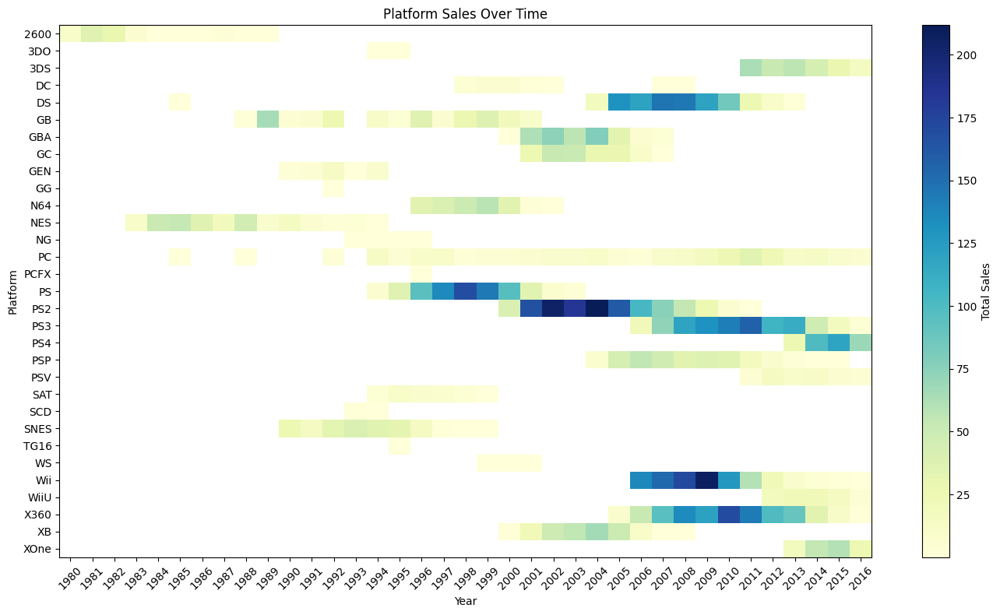

# 🎮 Video Game Sales Forecasting  
End‑to‑end data analysis and modeling project using Python, SQL, and machine learning to explore global video game sales and uncover behavioral patterns.

## 📌 Project Overview
This project analyzes global video game sales data to identify trends, understand market behavior, and build predictive models. The workflow includes data cleaning, exploratory data analysis (EDA), feature engineering, and machine learning classification/clustering.

## 🧰 Tech Stack
- **Python** (Pandas, NumPy, Scikit‑learn)
- **SQL**
- **Jupyter Notebooks**
- **Matplotlib / Seaborn**
- **GitHub**

## 📊 Key Features
- Cleaned and validated raw sales data  
- Performed exploratory data analysis to identify trends  
- Built classification and clustering models  
- Engineered features to improve model accuracy  
- Created visualizations for non‑technical stakeholders  

## 📈 Results
- Identified top‑performing genres and regions  
- Improved segmentation accuracy using clustering  
- Enhanced dataset quality through feature engineering  
- Delivered insights that support forecasting and decision‑making  

## 📂 Repository Structure
- 01_README.md
- 02_requirements.txt
- 03_.gitignore.txt
- 04_Video_Games_Analysis.ipynb

## 🖼️ Sample Visualizations

## 🚀 How to Run
1. Clone the repository  
2. Install dependencies  
3. Open the Jupyter notebook  
4. Run cells in order  

## 🔗 Links
- **Portfolio:** (https://McGawAmber.github.io/my-website)
- **GitHub Repo:** (https://github.com/McGawAmber/mobile-plan-classification)

## 📬 Contact
If you'd like to discuss this project or collaborate, feel free to reach out.  

